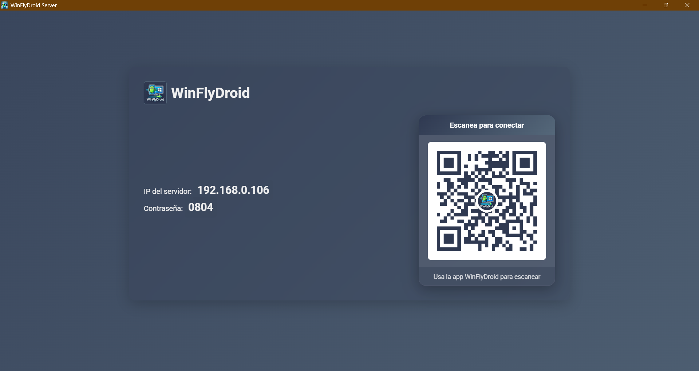
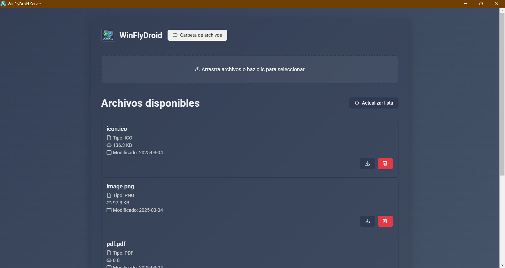
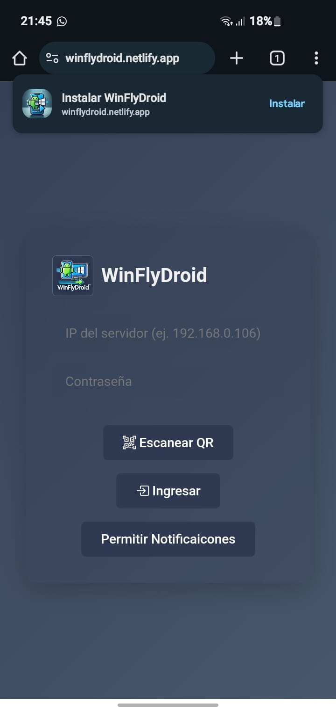
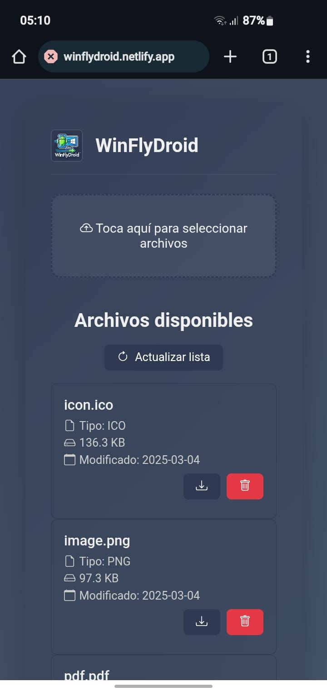

# WinFlyDroid  
*Transfiere archivos entre Windows y Android de manera sencilla y rápida*

## Tabla de Contenidos
- [Introducción](#introducción)
- [Características](#características)
- [Requisitos Previos](#requisitos-previos)
- [Cómo se Utiliza](#cómo-se-utiliza)
- [Preguntas Frecuentes](#preguntas-frecuentes)
- [Contribuciones](#contribuciones)
- [Donaciones](#donaciones)
- [Historial de Versiones](#historial-de-versiones)
- [Contacto](#contacto)
- [Licencia](#licencia)

---

## Introducción
**WinFlyDroid** es un proyecto de código abierto bajo licencia MIT, gratuito y diseñado para facilitar la transferencia de archivos entre dispositivos Windows y Android de forma rápida, segura y sin complicaciones. Este proyecto es ideal tanto para usuarios finales como para desarrolladores interesados en colaborar o integrar su funcionalidad.

---

## Características
- **Transferencia Rápida:** Envía y recibe archivos de forma instantánea.
- **Interfaz Intuitiva:** Diseño sencillo y fácil de usar, accesible para cualquier usuario.
- **Compatibilidad:** Soporta múltiples formatos y conexiones seguras.
- **Multiplataforma:** Funciona de manera óptima en entornos Windows y dispositivos Android.
- **API Integrada:** Hospeda localmente una API que ofrece control total sobre tus archivos privados.

---

## Requisitos Previos
- **Sistema Operativo:** Windows 10 o superior y un dispositivo Android compatible.
- **Conexión de Red:** Ambos dispositivos deben estar conectados a la misma red Wi-Fi.
- **Certificado Autofirmado:**  
  La aplicación utiliza un certificado autofirmado. Durante la conexión, la app cliente te guiará en el proceso de autorización. Es recomendable leer las instrucciones detalladas para garantizar una conexión segura.

---

## Cómo se Utiliza

### En Windows
1. **Descarga e Instalación:**  
   Descarga la versión compilada desde la web:  
   [WinFlyDroid Download Web](https://download-wfd.netlify.app)
2. **Ejecución:**  
   Al iniciar la aplicación en Windows, se mostrará la IP donde se lanza la API, el "Sesion Pass" y un código QR que contiene estos datos.

### En Android
1. **Acceso a la App:**  
   Ingresa a [WinFlyDroid Android App](https://winflydroid.netlify.app) para utilizar la aplicación cliente o instalar la PWA.
2. **Conexión:**  
   Escanea el código QR o ingresa las credenciales manualmente para conectar con el servidor Windows.

### Transferencia de Archivos
1. **Selección:**  
   Utiliza la interfaz para navegar y elegir los archivos que deseas transferir.
2. **Gestión:**  
   Visualiza y administra los archivos disponibles en la interfaz de ambos dispositivos.

---

## Preguntas Frecuentes
- **¿Cómo autorizo el certificado autofirmado en Android?**  
  La aplicación te guiará paso a paso para autorizar el certificado. Si encuentras inconvenientes, revisa la sección de "Solución de Problemas" en la app.
  
- **¿Qué hacer si los dispositivos no se conectan?**  
  Asegúrate de que ambos dispositivos estén conectados a la misma red Wi-Fi y verifica que no existan bloqueos en el firewall. Reinicia la aplicación en caso necesario.

---

## Contribuciones
**WinFlyDroid** es un proyecto colaborativo y se agradecen todas las aportaciones. Para contribuir:
1. Realiza un fork del repositorio (si está disponible en plataformas como GitHub).
2. Crea una rama para la nueva funcionalidad o corrección:
   ```
   git checkout -b feature/nueva-caracteristica
   ```
3. Realiza los cambios y haz commit:
   ```
   git commit -m 'Añadir nueva característica'
   ```
4. Envía la rama al repositorio remoto:
   ```
   git push origin feature/nueva-caracteristica
   ```
5. Abre un Pull Request en el repositorio original.

---

## Donaciones
Si deseas apoyar el desarrollo de **WinFlyDroid**, considera realizar una donación. Tu aporte es fundamental para seguir mejorando la herramienta. En breve se añadirá más información sobre métodos de donación (PayPal, criptomonedas, etc.).

---

## Historial de Versiones
- **v1.0:** Lanzamiento inicial con funcionalidades básicas de transferencia de archivos y API integrada.  
*(Las futuras actualizaciones se documentarán en esta sección.)*

---

## Contacto
Este proyecto fue desarrollado por **@DevnisG**. Para dudas, sugerencias o soporte, contáctame a través de:
- **Correo electrónico:** denis.gontero.20000@gmail.com
- **Discord:** @twelveconet

---

## Licencia
Este proyecto está licenciado bajo la [Licencia MIT](https://opensource.org/licenses/MIT).

---

## Vista Previa de WinFlyDroid

### WinFlyDroid Server:
  


### WinFlyDroid Client:
  

